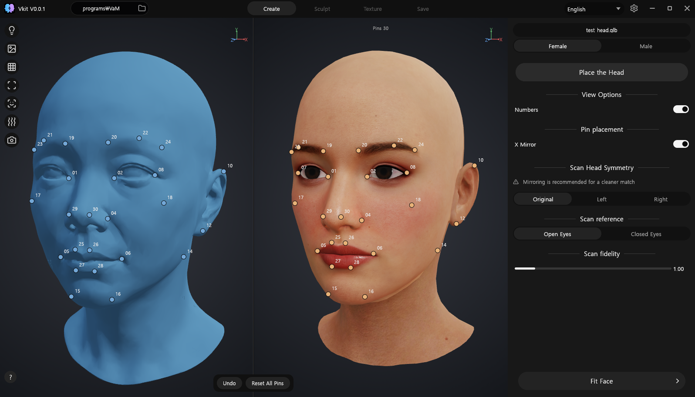
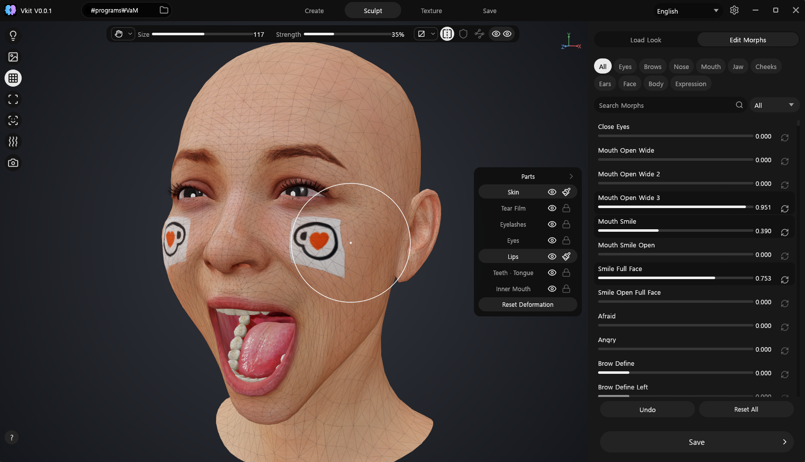
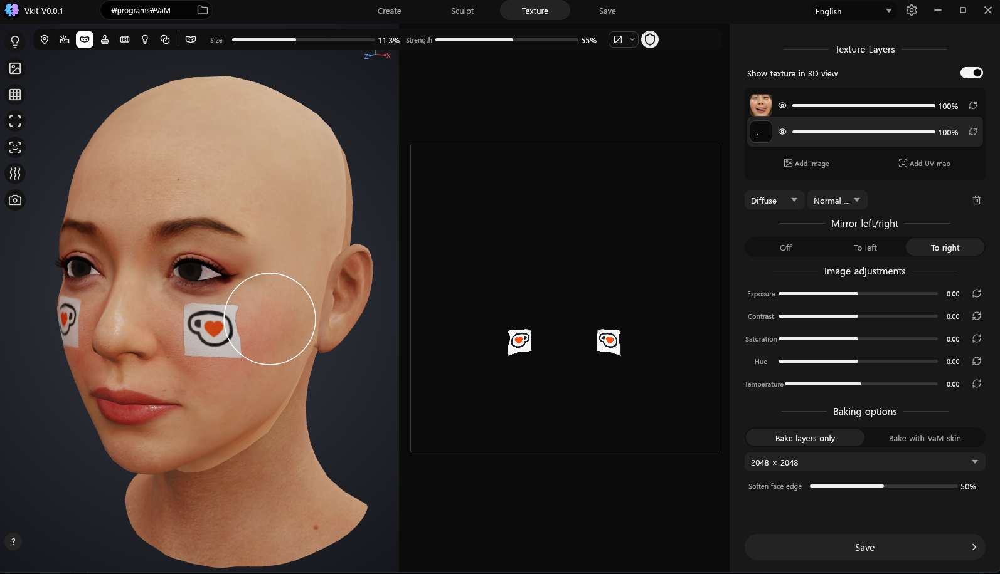
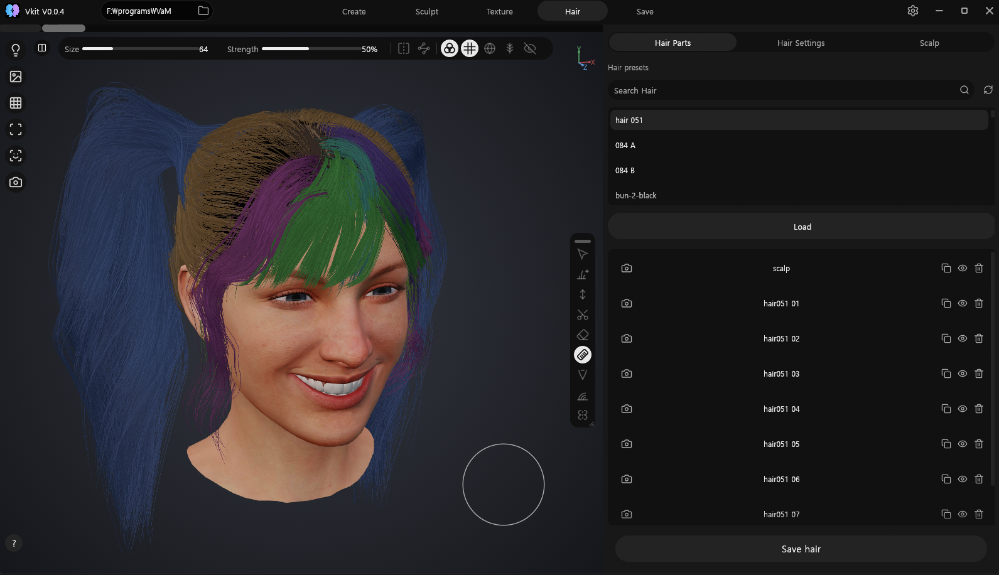
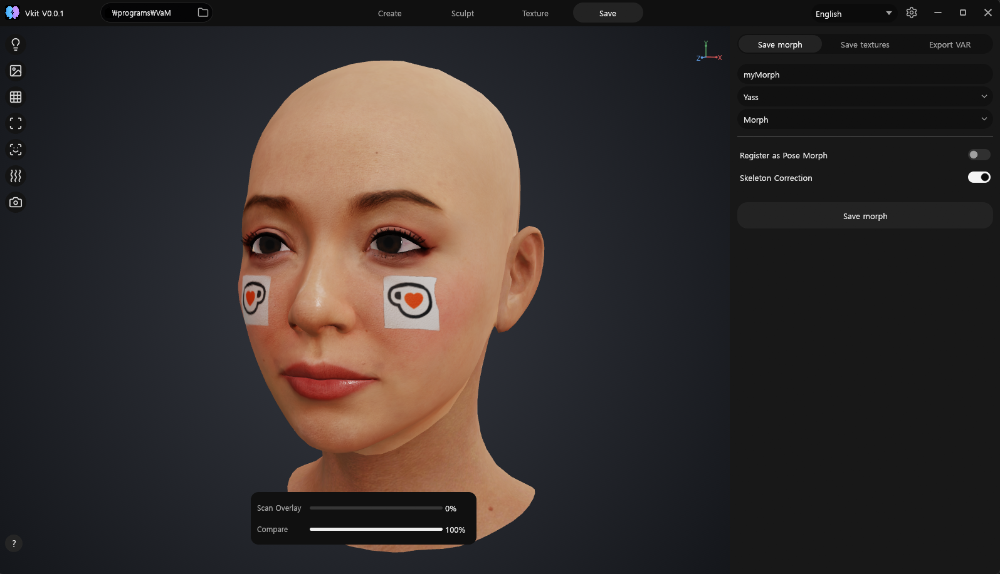

<h1 align="center">Vkit</h1>

<p align="center">
  <b>A companion tool for making Virt-A-Mate head morphs and hair.</b><br>
  Fit a face to a scan or a photo, sculpt it, paint it, grow hair on it, and
  write it all back to VaM — from a single Windows executable, with no
  installer.
</p>

<p align="center">
  
  
  
  
  
</p>

<p align="center">
  
  <br>
  <sub>A scan on the left, Genesis 2 on the right, and the pin pairs that tie the two together.</sub>
</p>

---

Vkit is a companion tool for [Virt-A-Mate](https://www.virtamate.com/) that
makes head morphs and hair. It reads the base figure, the morph library, the
skins and the hair out of your own VaM installation, lets you build a face
against them, and writes the result back as a VaM morph pair, a texture set, a
hair item, or a `.var` package.

One Rust binary — egui and wgpu on Direct3D 12. No Python sidecar, no WebView,
no redistributables, no installer, and nothing to install beside it. Scans are
read in-process: OBJ by Vkit's own parser, glTF and GLB — including Draco and
meshopt compression — and FBX through Rust crates linked into the binary.
Everything VaM reads is written by Vkit's own writers.

The one thing it sends over the network is a question about itself: on launch it
asks GitHub whether a newer release exists, and shows a small badge beside the
version if there is one. Nothing else leaves the machine, nothing is uploaded,
and every failure — no connection, a proxy, a rate limit — is silent. Clicking
the badge opens the release page in your browser; Vkit never updates itself.

> **You need your own Virt-A-Mate installation.** Virt-A-Mate belongs to
> MeshedVR, and Genesis 2 is DAZ 3D's and follows DAZ's terms. Vkit ships none
> of it and depends entirely on the files already installed on your machine; all
> rights stay with their authors. This is an experimental tool that assists
> editing, nothing more.

## What it does

Five stages, left to right along the top of the window.

| | Stage | |
|---|---|---|
| **1** | **Create** | Start from a 3D scan (OBJ / glTF / GLB / FBX, all read in-process), from a photograph projected onto the surface, or from a look already installed in VaM. Place numbered pin pairs — or let the bundled MediaPipe Face Landmarker place them — then fit: weighted similarity alignment, a Laplacian pin warp, and three-stage dense registration. Eyes, mouth and nostrils are held rigid, and Genesis 2 vertex order survives untouched. |
| **2** | **Sculpt** | Grab, smooth and restore brushes, plus the whole morph library from your install with search, categories and translated names. Sculpt strokes and morph values are kept apart and recomposed, so moving between them never costs you either. |
| **3** | **Texture** | Layers on the face UV: paint, clone, heal, dodge and burn, stamps, a positionable stencil, projection as its own brush, mirroring, and a bake to a finished texture set. |
| **4** | **Hair** | Grow hair on the head you just made, or take a style already installed in VaM apart into layers you can edit. Plant guide strands on the scalp with a brush, and the strands between them are interpolated the way VaM interpolates them. Parts stack as layers with their own length, curl, spread, stiffness, physics and colour — 65 parameters, each one a VaM storable written straight through. The scalp is a layer of its own with its own page: pick the built-in cap mesh, give it a sheet and a cutout of your own, and tune a material that starts from the values VaM ships that mesh with. The viewport runs VaM's own solver, so what drapes here drapes there. It saves as a `Custom/Hair` item: `.vam`, `.vaj`, `.vab` and a default `.vap` preset, with a thumbnail per part. |
| **5** | **Save** | A VaM morph pair (`.vmi` + `.vmb`) into `Custom/Atom/Person/Morphs/`, the baked texture set, or a self-contained `.var` written by the same code that reads one. A saved morph pair reaches VaM through **Reload Custom Morphs**; a saved `.var` needs VaM restarted, because `AddonPackages` is enumerated once at startup and that button rescans the loose morph folders rather than the mounted packages. Vkit says which of the two you just did, under the button. |

A style already installed in VaM can be taken apart in the Hair stage and
edited as layers — the solver, the curl, the drape capture and the body
collision were measured out of VaM rather than approximated, so a style looks
here the way it will look there.

Nothing Vkit writes goes anywhere near your VaM installation's own files. It
reads them; what it produces lands in `Custom/` or `AddonPackages/`, the same
places VaM picks up anybody else's content from.

## The other stages

**Sculpt.** Your install's own morph library — searchable, categorised, names
translated — beside brushes that move the mesh directly. Parts can be soloed or
hidden while you work.

<p align="center">
  
</p>

**Texture.** Layers on the face UV, painted on the model or on the flat map,
whichever is easier to aim. Mirroring, per-layer colour adjustment, and a bake
that ends as a finished texture set at 2K or 4K.

<p align="center">
  
</p>

**Hair.** Plant guide strands with a brush and Vkit fills in between them the way
VaM does. Or open a style you already own: its parts arrive as layers you can
comb, cut and recolour, with the scalp lifted out into a layer of its own.

<p align="center">
  
</p>

**Save.** The morph pair, the texture set, or a `.var` — and a compare slider to
put the result back against the scan you started from before you commit to it.

<p align="center">
  
</p>

## Getting started

1. **Download** `Vkit.exe` from [Releases](https://github.com/yass3d/vkit/releases)
   and run it. There is no installer; it is one file. Windows SmartScreen will
   warn about an unknown publisher, because the build is not code-signed.
2. **Point it at VaM.** Settings → General → VaM installation, or the field in
   the title bar. Vkit reads the base figure and builds its morph catalog on the
   first run (about a quarter of a second) and caches it afterwards.
3. **Load a face** in the Create tab and fit it.

Settings, logs and caches live outside the program folder, so the executable
stays a single portable file:

    %LOCALAPPDATA%\Vkit\settings.json
    %LOCALAPPDATA%\Vkit\logs\vkit.log
    %LOCALAPPDATA%\Vkit\logs\crash.log
    %LOCALAPPDATA%\Vkit\cache\

## When it goes wrong

Each run gets its own `vkit.log`; the three before it are kept as `vkit.log.1`,
`.2` and `.3`. If the program falls over it also appends to `crash.log` — a
timestamped panic with a backtrace, written through a file handle of its own so
it survives whatever just failed, and never overwritten by the next one.

**Settings → About** names those files, opens the folder holding them, and links
to the issue tracker. Or go straight there:
[github.com/yass3d/vkit/issues](https://github.com/yass3d/vkit/issues). Attach
them — a crash nobody else can see is a crash nobody can fix. **After a crash,
the run that crashed is `vkit.log.1`, not `vkit.log`:** reopening Vkit to read
that page is itself a new run, and starting one rotates the log. Three launches
later it is deleted.

The log carries no environment dump and no command line. It does carry file
paths — the running executable, the fonts loaded for your language, the files
you opened and exported, and the folders it caches in —
and any of those inside your user profile spells out your Windows account name.
It is plain text; read it before attaching it to a public issue if that matters
to you.

## Getting around

**Navigation follows Blender**, deliberately — most people arriving here already
have those reflexes, and a 3D tool that invents its own camera is a tool you have
to learn twice.

| | |
|---|---|
| Orbit | Middle-mouse drag |
| Pan | Shift + middle-mouse drag |
| Zoom | Wheel (anchored on the point under the cursor), or Ctrl + middle-drag |
| Snap orbit to 45° | Alt + middle-mouse drag |
| Standard views | Numpad 4 / 6 — left, right; 8 / 2 — top, bottom |
| Front diagonals | Numpad 7 / 9 — upper left, upper right; 1 / 3 — lower left, lower right |
| Perspective ↔ orthographic | Numpad 5 |
| Reset the camera | Home, Numpad 0, or Numpad `.` |
| Frame the head | `F` |
| Free rotate and roll | `R`, then drag; `R` or a click to leave |
| Rotate the light | Shift + right-drag |

The left mouse button never moves the camera — it places pins and paints — which
is Blender with *Emulate 3 Button Mouse* off. The 2D texture view swaps to
Photoshop habits instead: wheel to zoom, middle-drag or Space + drag to pan.

**Hover any control for half a second and it tells you what it does.** Vkit is
dense on purpose, and the tooltips are the manual — they cover every brush, every
slider and every toggle. If you find them distracting they can be turned off in
Settings → Interface.

The interface is Korean-first with complete English and Japanese, plus complete
packs for Chinese (Simplified and Traditional), Spanish, Portuguese, French,
German, Russian, Hindi, Indonesian, Vietnamese, Thai and Bengali. Change it in
Settings → General.

## Requirements

- **Windows 10 or 11, x64.**
- **A DX12-capable GPU.** wgpu is compiled with the DX12 backend only — there is
  no Vulkan, GL or software fallback.
- **Your own Virt-A-Mate installation.** Without it there is no base figure, no
  morph library and no skins. The figure it works on is the one VaM ships —
  Genesis 2, female and male — and only the head of it; no other figure is read
  as a base. Every format decision here was checked against **VaM 1.22.0.13**,
  which Settings → About also states, so a refused file can be told apart from
  a newer install this has not been measured on.
- Nothing else — no Blender, no Python, no runtime to install. The CRT is
  linked statically and the executable imports Windows system DLLs only.

## Building

From the project root:

```powershell
.\Build_Vkit_Native.cmd
```

That runs the workspace tests, builds the `release-small` profile for
`x86_64-pc-windows-msvc`, and audits the result before publishing it: static CRT,
Windows-system imports only, a 48 MiB size gate, and exactly one file in the
output directory.

    dist\native\Vkit.exe        the only distributable item
    logs\native-build.json      the receipt — size, SHA-256, imports

You need **Rust 1.92+** (edition 2024, `x86_64-pc-windows-msvc`) and the **MSVC
build tools** — the audit shells out to `dumpbin.exe`. Working directly with
cargo, from `native\`:

```powershell
cargo test --workspace
cargo fmt --all -- --check
cargo clippy --workspace --all-targets -- -D warnings
```

The dev profile compiles the numeric crates and the image stack optimized on
purpose: at `opt-level 0` fitting and skin decoding are unusable.

## What this is not

- **Not a Virt-A-Mate replacement, and not a poser or animator.** Posing, rigging
  and everything below the neck are deliberately out of the build. VaM's pose
  behaviour cannot be reproduced by replaying bone rotations, and the half that
  works is worse than none.
- **Not a general 3D modeller.** The sculpt and paint tools exist to finish a
  face on a fixed topology, not to author arbitrary meshes.
- **Not a source of content.** It bundles no figures, no skins, and no morph
  bank. Every shape it can put on a face comes from the install you pointed it
  at.
- **Not signed or packaged.** No installer, no auto-update, no code-signing
  certificate. Verify the SHA-256 in the release notes against the receipt.
- **Not stable.** Pre-1.0: formats, settings and exported layouts may change.

## Repository layout

    native/vkit_app             Windows DX12 UI, renderer, workflow
    native/vkit_core            formats, fitting, anatomy, morphs, VaM I/O
    native/vkit_geometry_core   BVH, intersection, topology kernels
    native/vkit_semantic        Face Landmarker V2 inference via tract
    native/vendor/tract-tflite  vendored crate, one documented importer patch
    build/windows               single-EXE build, audit, local signing

## License

Copyright 2026 Vkit contributors. **MIT or Apache-2.0, at your option** — see
[`LICENSE.md`](LICENSE.md), [`LICENSE-MIT`](LICENSE-MIT),
[`LICENSE-APACHE`](LICENSE-APACHE) and [`NOTICE`](NOTICE). Provided as is,
without warranty.

That covers Vkit's own code and nothing else. Virt-A-Mate is MeshedVR's;
Genesis 2 is DAZ 3D's and follows DAZ's terms. Vkit works on the content already
installed on your machine, all rights to it remain with its authors, and their
terms follow anything you export.

Third-party components keep their own terms:
[`build/windows/THIRD-PARTY-NOTICE.txt`](build/windows/THIRD-PARTY-NOTICE.txt),
`native/vendor/tract-tflite/LICENSE-{MIT,APACHE}`,
`native/vkit_app/resources/icons/LUCIDE-LICENSE.txt`, and
`native/vkit_semantic/MODEL_PROVENANCE.md`.


## Support

Vkit is free and stays free. If it saved you an afternoon and you feel like it:
[ko-fi.com/yass_3d](https://ko-fi.com/yass_3d). It unlocks nothing and is owed
by nobody.
